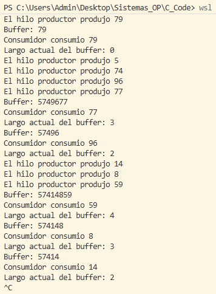

## Peterson TP

>En la imagen adjuntada se puede ver una secuencia de mensajes que muestran la produccion y consumo de numeros escritos en un buffer por un proceso productor un proceso consumidor. La cantidad de numeros producidos por el productor es aleatoria en cada iteracion que hace